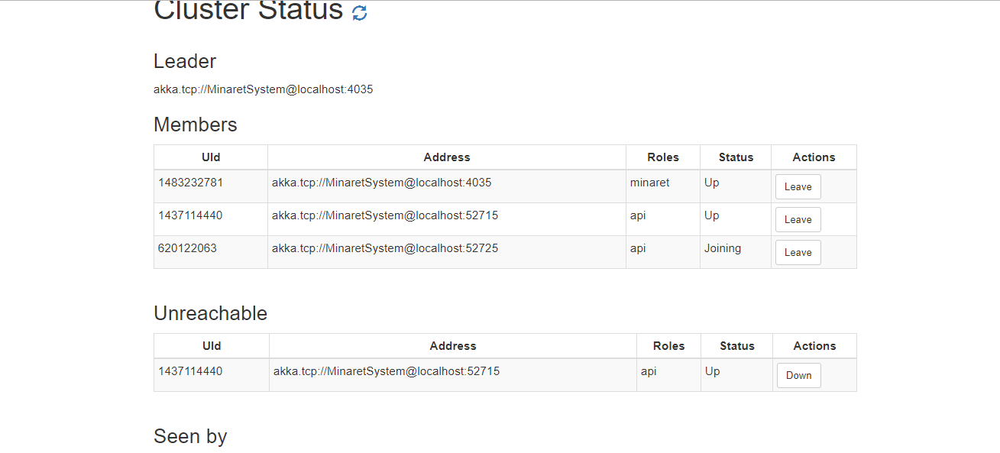

# Minaret.Client

A web client for [Minaret](https://github.com/crouch74/Minaret) cluster API.

## Getting Started

A simple cluster management interface, it views the status and lets you control the nodes.

* Inside src/shared/shared.config.js
 ```
 constant('API_SERVER', 'http://{API_SERVER}:{API_PORT}/api/')
 ```
* Run
```
npm install
```
* Ready to go
```
gulp serve
```



## License

This project is licensed under the MIT License - see the [LICENSE.txt](LICENSE.txt) file for details
